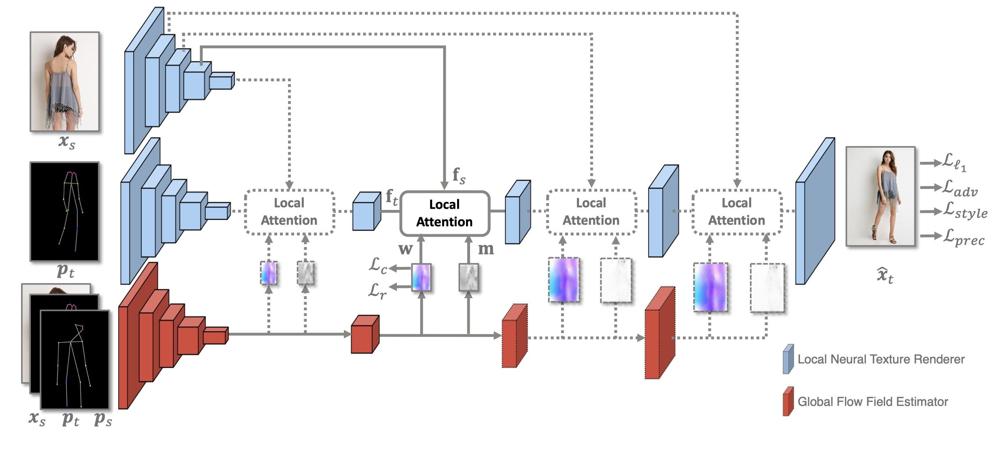

  
  

# **Abstract**
**Pose-guided person image generation** is to transform a source person image to a target pose. This task requires spatial manipulations of source data. However, Convolutional Neural Networks are limited by lacking the ability to spatially transform the inputs. In this paper, we propose a differentiable **global-flow local-attention framework** to reassemble the inputs at the feature level. Specifically, our model first calculates the global correlations between sources and targets to predict flow fields. Then, the flowed local patch pairs are extracted from the feature maps to calculate the local attention coefficients. Finally, we warp the source features using a content-aware sampling method with the obtained local attention coefficients. The results of both subjective and objective experiments demonstrate the superiority of our model. Besides, additional results in video animation and view synthesis show that our model is applicable to other tasks requiring spatial transformation.

# **Network Architecture**
The **Global-Flow Local-Attention** model is used to spatially transform the source image information at the feature level. A Global Flow Field Estimator is first employed to predict the flow fields between sources and targets. Then, a Local Neural Texture Renderer is used to to synthesize the final results using local attention.

The local attention blocks in the Local Neural Texture Renderer are responsible for transforming source information. The transformation process is shown below. For each target position, the corresponding local patch pair is first extracted. Then the local attention coefficients are predicted for content-aware sampling.

# **Results**
### **Pose-Guided Person Image Generation**

  
  

  Form Left to Right: Source, Target Pose, Target Image, <a herf="https://arxiv.org/abs/1801.00055">DefGAN</a>, <a herf="https://arxiv.org/abs/1804.04694">VU-Net</a>, <a href="https://arxiv.org/abs/1904.03349">Pose-Attn</a>, <a href="http://mmlab.ie.cuhk.edu.hk/projects/pose-transfer/">Intr-Flow</a>, Ours.

 

### **Pose-Guided Person Image Animation**

  
  

<b>From Left to Right</b>: Real Video, Extracted Pose, Animation Results.

### **Face Image Animation**
Given a source face and a sequence of edge images, our model generates the result video with specific motions.

  
  

    <b> Left</b>: Input Source Image and Edge Sequence, Right: Animation results.

### **Novel View Synthesis**
View synthesis requires generating novel views of objects or scenes based on arbitrary input views. In this task, we generate multi-images with different view points based on a single input source image.

  
  

Form Left to Right: Source, Results of <a href="https://arxiv.org/abs/1605.03557">Appearance flow</a>, Ours, and Ground-truth images.

 