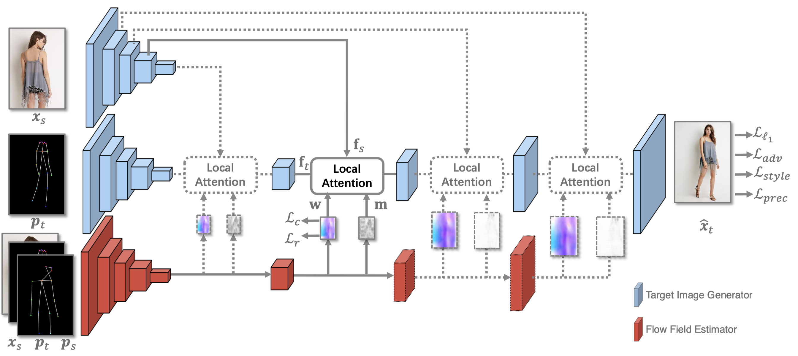
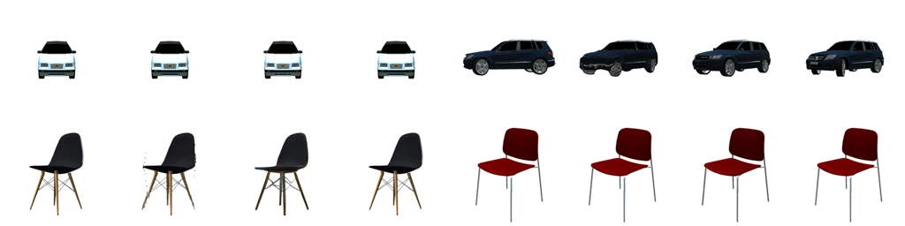

# Abstract
**Pose-guided person image generation** is to transform a source person image to a target pose. This task requires spatial manipulations of source data. However, Convolutional Neural Networks are limited by lacking the ability to spatially transform the inputs. In this paper, we propose a differentiable **global-flow local-attention framework** to reassemble the inputs at the feature level. Specifically, our model first calculates the global correlations between sources and targets to predict flow fields. Then, the flowed local patch pairs are extracted from the feature maps to calculate the local attention coefficients. Finally, we warp the source features using a content-aware sampling method with the obtained local attention coefficients. The results of both subjective and objective experiments demonstrate the superiority of our model. Besides, additional results in video animation and view synthesis show that our model is applicable to other tasks requiring spatial transformation.

# Network Architecture
Our network spatially transform the image features using a **Global-Flow Local-Attention** manner. First, the Flow Field Estimate is used to obtain the global flow fields which indicate the approximate sampling positions.

Then, the local attention operation is performed for each local patch in the target features centered at position _l_. This operation allows the network sampling vivid textures from the source features according to the target pose. 

# Results and Applications

### Pose-based Person Image Generation

  
  

  Form Left to Right: Source, Target Pose, Target Image, <a herf="https://arxiv.org/abs/1801.00055">DefGAN</a>, <a herf="https://arxiv.org/abs/1804.04694">VU-Net</a>, <a href="https://arxiv.org/abs/1904.03349">Pose-Attn</a>, <a href="http://mmlab.ie.cuhk.edu.hk/projects/pose-transfer/">Intr-Flow</a>, Ours.

 

### Image Animations

  
  

### View Synthesis

  
  

Form Left to Right: Source, Results of <a href="https://arxiv.org/abs/1605.03557">Appearance flow</a>, Ours, and Ground-truth images.

 